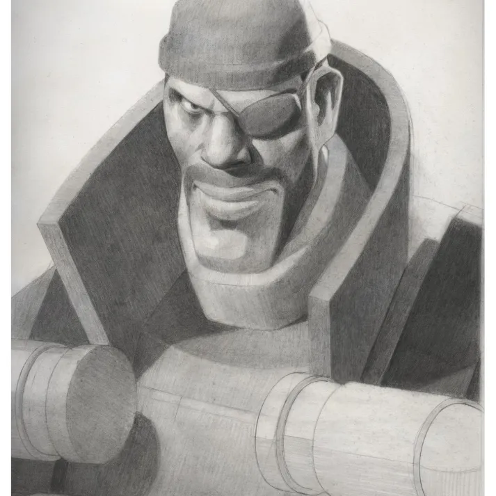
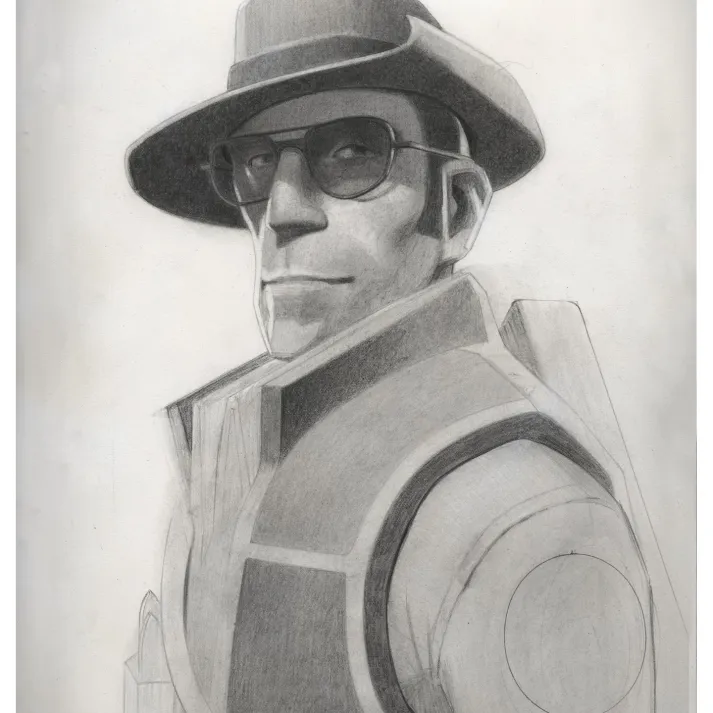
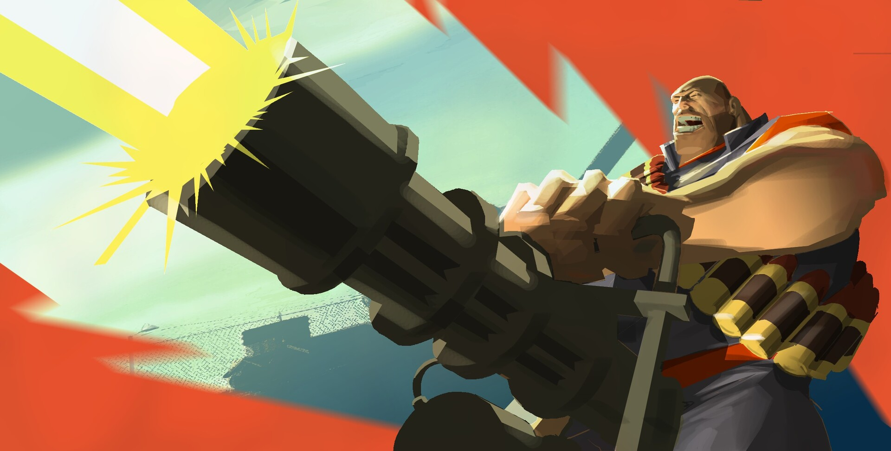
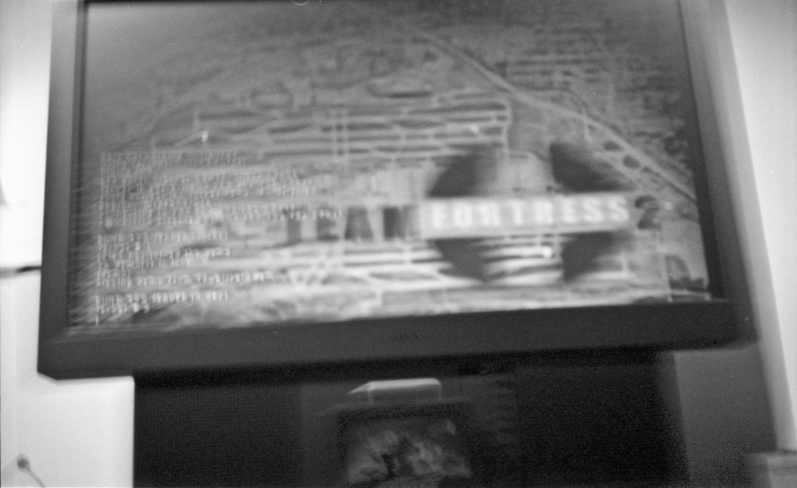
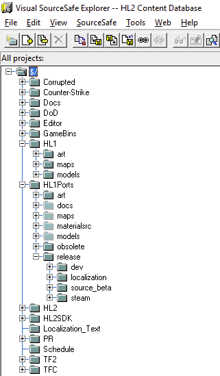

# Valve Archive 2

A convenient list of links.

Focus:

* What Valve Archive doesn't include,
* What Valve Archive *won't* include.

Embed: Discord link

## Notable Archives

(https://archive.surfacesphere.xyz/)[https://archive.surfacesphere.xyz/]

## Repo Leak

* [Myrient](https://myrient.erista.me/files/Miscellaneous/Valve%20Developer%20Repository/)
* [Torrent](magnet:?xt=urn:btih:5ac001d86b20f7f7dbe29880dbfef16c64a34a91&dn=Valve%20Leaks&xl=32757729478&tr=udp%3A%2F%2Ftracker.opentrackr.org%3A1337%2Fannounce&tr=udp%3A%2F%2Fopen.tracker.cl%3A1337%2Fannounce&tr=udp%3A%2F%2F9.rarbg.com%3A2810%2Fannounce&tr=udp%3A%2F%2Ftracker.openbittorrent.com%3A6969%2Fannounce&tr=udp%3A%2F%2Fopentracker.i2p.rocks%3A6969%2Fannounce&tr=https%3A%2F%2Fopentracker.i2p.rocks%3A443%2Fannounce&tr=http%3A%2F%2Ftracker.openbittorrent.com%3A80%2Fannounce&tr=udp%3A%2F%2Fwww.torrent.eu.org%3A451%2Fannounce&tr=udp%3A%2F%2Ftracker.torrent.eu.org%3A451%2Fannounce&tr=udp%3A%2F%2Fopen.stealth.si%3A80%2Fannounce&tr=udp%3A%2F%2Fexodus.desync.com%3A6969%2Fannounce&tr=udp%3A%2F%2Ftracker.tiny-vps.com%3A6969%2Fannounce&tr=udp%3A%2F%2Fipv4.tracker.harry.lu%3A80%2Fannounce&tr=udp%3A%2F%2Ftracker1.bt.moack.co.kr%3A80%2Fannounce&tr=udp%3A%2F%2Ftracker.zerobytes.xyz%3A1337%2Fannounce&tr=udp%3A%2F%2Ftracker.theoks.net%3A6969%2Fannounce&tr=udp%3A%2F%2Ftracker.pomf.se%3A80%2Fannounce&tr=udp%3A%2F%2Ftracker.monitorit4.me%3A6969%2Fannounce&tr=udp%3A%2F%2Ftracker.loadbt.com%3A6969%2Fannounce&tr=udp%3A%2F%2Ftracker.lelux.fi%3A6969%2Fannounce)
* └─> Don't have a torrent client? Try [qBittorrent](https://www.qbittorrent.org/download) to open this.

## Games

### Counter Strike

* [2011/08/10 Build](https://drive.google.com/file/d/1bsp3UiwOnwFD1VCz5VHZEJnSo7bQ8owS/view)
https://hiddenpalace.org/Counter-Strike:_Global_Offensive_(Sep_13,_2012_21.45_prototype)
https://hiddenpalace.org/Counter-Strike:_Global_Offensive_(Sep_13,_2012_22.37_prototype)
https://hiddenpalace.org/Counter-Strike:_Global_Offensive_(Sep_13,_2012_23.20_prototype)

---

* [Prerelease Weapon Models](img/Prerelease%20Weapon%20Models%20(Unknown%20Date).7z)
* [CSGN_Brian.ZTL](img/CSGN_Brian.ztl)
* [2019/04/10 C4 Sources](img/C4%20(10-02-2019).7z)
* [Various PSDs](https://drive.google.com/drive/folders/1ak8x2DiBi7JxDuq1F-WvSpRl6dt1YOEN?usp=sharing)

---

* [Counter-Strike Source Mapsources](https://drive.google.com/file/d/1tV7DxBnBx0h4b_S3rCRzWVEQ1cONY9bh/view?usp=sharing)
* [2003 Counter-Strike Press Disk](https://drive.google.com/file/d/1WXU2T_llhPX2JJ8mOefg2C2PyWXbXUCL/view)
* [Venice Textures for CS 1.6](https://archive.org/details/venice_textures)


### Deadlock

* [Build from 2024/05/26](https://drive.google.com/file/d/1ZXbUBaBokcsn_fgfFCZUEW2wkUtOSQzT/view?usp=sharing)
* [└─> Crack files(?)](https://drive.google.com/file/d/1hI6wu6l01WWzegbwhu6yN-n0Nw4CKGVD/view?usp=sharing)
```
change appid to 730 in
gameinfo_branchspecific.gi
steam.inf
steam_appid.txt
```
* [Build from 2024/06/20](https://drive.google.com/file/d/1Q9am9kuve584RBu251KWFv2H4D3rFtzD/view)
* [Build from 2024/07/11](https://drive.google.com/file/d/10MeAQ1W8drlTcI9QuMzMX7Z3tUVrMTIL/view?usp=sharing)
* [└─> Crack files](https://www.mediafire.com/file/z7r8lfk9prtqx6h/7-11-24_crackfiles.zip/file)
* [Build from 2024/10/24](https://drive.google.com/file/d/1Wat2GMksWumMJOymkSR0PjqIa3_xqgY-/view?usp=drive_link)

---

* [Neon Prime's tutorial videos](https://www.youtube.com/watch?v=xqJsU0iN_UI)
* [Early playtest video](https://drive.google.com/file/d/1ttz882aMOPHrGmcH-Tpng6I4y3x3OtYz/view?usp=sharing)

---

* [Deadlock/Neon Prime Design Document Leak](https://archive.org/details/deadlockdesign/k0lxov/mode/2up)
* [Deadlock Playtest Hero "Prototype" Models as of 8/26/24](https://archive.org/details/deadlock_hero_protomodels)
* [Deadlock All Leaked Footage, Cleaned Up & Organized](https://archive.org/details/deadlock-all-leaked-footage-cleaned-up-organized)

### Half-Life

* [Half-Life: Source developer repo](https://drive.google.com/file/d/1XgdbsWULhkWs6eBbrQnFcLTe92reKQz5/view?usp=sharing)
* [Half-Life Animation Development Files](https://archive.org/details/hldevfiles)
---
* [Missing Half-Life monster demonstrations](https://archive.org/details/monsteroftheweek_202303)
* [Dario's 25th anniversary mapping commentary](https://youtu.be/naWgflzwwTc)
* [Various screenshots and concept art](img/hlarchivebeta7.zip)
### Half-Life 2

* [Half Life 2 "RepoDump4" repo leak](https://drive.google.com/file/d/1eGCl2oI4zoeSoHhtLYsrMk2DUZgObsk2/view?usp=sharing)
* [└─> Files unique to this that aren't in the other leak](https://drive.google.com/file/d/1sQcdKFaFQWiXaCVGeLo-4rM9v32AuzfR/view?usp=sharing)
* [Miscellaneous "beta - 2" leak](https://drive.google.com/file/d/1hVtRMHIjPrXRZ7tgD2S-UWo5Qs5rbfyb/view)

---
* [HL2 & EP2 press images](https://www.mediafire.com/file/vp2zh2ze35f7qn3/HL2_HL2EP2_Arts.rar/file)
* [HL2 E3 demonstration with Gabe Newell commentary](https://youtu.be/PbBk5i2Nlxo)

References

| 1 | 2 |
| --- | --- |
|  | 

### Half-Life 2: Episode 2

* [Cache of screenshots & high-quality art](https://drive.google.com/file/d/1YAjMwerQDwGTq6mW83JoNoda2lL72Pmz/view?usp=sharing)

### Half-Life 2: Episode 4 (Return to Ravenholm)

* [Mutated Grigori concepts](https://www.artstation.com/artwork/6N8kr0)

### Left 4 Dead

* [L4D0 Sources and assets](https://drive.google.com/drive/folders/18b-ddtww3GrVLVAouYZ4s2tm63jorx7-?usp=sharing)

---
* [Initial release of Left 4 Dead](https://archive.org/details/left-4-dead-v-1.0.0.0)

### Portal

* [Portal 2 2014 developer build](https://mega.nz/file/KNADTBxJ#tKb_grGtl5h4qKZLiQFq9T5RXf4aAfmkqU9ux6oNkYo)
* [Archive of early postrelease Portal 2 depots](https://gofile.io/d/J6h8ed)

---
* [Pel's "celestine_body"](https://drive.google.com/file/d/17TAaG-AR1QUs4PxuuhUZpf2oXrRZ9KA5/view?usp=sharing)
* [Core Hub era Glados texture](https://drive.google.com/file/d/1sLqMygs__fOwZyCE3EERBX3LZkQVY2Ve/view?usp=sharing)
* [Stems for the turret opera. Uncertain legitimacy.](https://drive.google.com/file/d/15esxnwxItP-3WxHA8PWrZrceGO47I8mB/view?usp=sharing )
* [Portal 2 TV Spot Older Render](https://archive.org/details/portal2_tvspot_old)


## Team Fortress 2

* [Full TF repository leak](https://drive.google.com/file/d/1vA_YiVkpU-iJfjcwAzb5VszONAbRn81S/view)
* [Postal 3 full leak](https://hgrunt.xyz/filedrop/Postal+III.rar)

---
* [Moby Francke powerpoint file](https://docs.google.com/presentation/d/1qGb_AYyrTXXWniJ30ByE9kYJCIUxhs6p/edit?usp=sharing&ouid=109539870747969870414&rtpof=true&sd=true)
	*  └─> [Extracted Images](img/media.zip)

---
* [Fixed XML DMXs](https://drive.google.com/file/d/1OV4i6xm3aeqNHiS2ytML0src7X73E2DA/view)
* [Trailer 1 font](https://drive.google.com/file/d/1-KR9Rsq6ueS_ysWfxJCmfC4WMBuyW5N3/view)

---
* [Scrapped Halloween 2014 animation](https://www.youtube.com/watch?v=4PIZsGNvNNE)
* [MTT Sniper Song Variations](https://archive.org/details/mtt_sniper_music_09_novox)
* [Early Expiration Date leak doc](img/Copy%20of%2015%20min%20leak.docx)
* [Early Expiration Date assets](img/fixedshorts.7z)
* [Original Meet The Spy monologue](img/bateman_first_spy.wav)

| Spy Image    |     |
| --- | --- |
|  |     |

| Moby Francke portrait sketches                              |                               |                               |
| ----------------------------- | ----------------------------- | ----------------------------- |
|  |   |   |
|  |   |  |
|  |  |  |


| [Leeroy Vanilla comic art](https://www.artstation.com/artwork/Zebe98)    |     |
| --- | --- |
|     |     |


| Jeff Balinger Images    |     | |
| --- | --- | --- |
|  |  |  |
|  | 

## Team Fortress 2 (Early)


| Rubin Highschool shots    |     |
| --- | --- |
|     |     |


## Mods


### Boreal Alyph

* [Earlier Build](https://drive.google.com/file/d/1Z3dGdPWhYmvD6YrfBJszh3OuZvDNmEHZ/view)
* [Later Build](https://archive.org/details/boreal-alyph-b0.5.1498-stable)

### Exposure

* [Build from 2023/01/01](https://hgrunt.xyz/filedrop/Exposure%201-10-23.7z)

---
* [Exposure clips 1](https://drive.google.com/file/d/1B3AMM_nLyakRlDhfI_s7pW6axyPptJ-i/view?usp=sharing)
* [Exposure clips 2](https://drive.google.com/file/d/1B3AMM_nLyakRlDhfI_s7pW6axyPptJ-i/view)

## Other

[1998 Valve Software IRC interviews](https://archive.org/details/irc-interviews)

Valve VSS shots: 

| 1                                    | 2                                    | 3                                    |
| ------------------------------------ | ------------------------------------ | ------------------------------------ |
|  |  |  |

## Src

[Tactical Intervention Source](https://archive.org/details/taicnt-code)